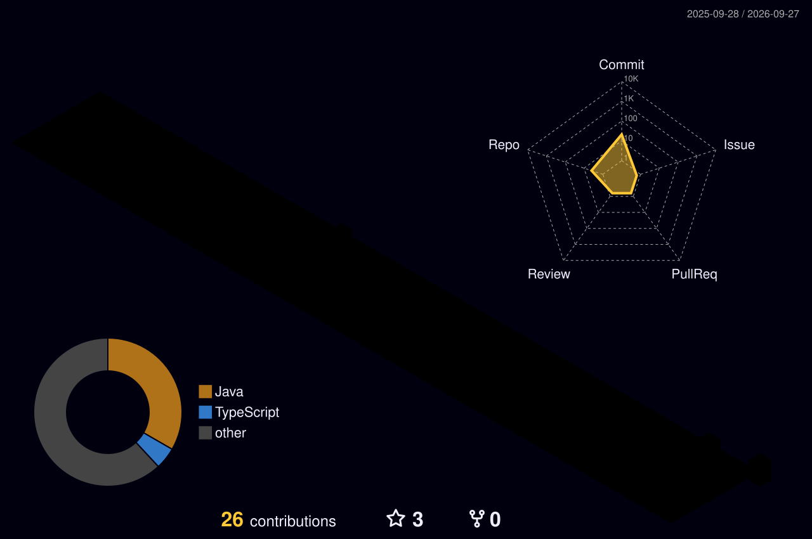

<div align="center">


<br/>

<a href="https://github.com/Suryakanta-Creator">
  
</a>
<a href="https://www.linkedin.com/in/suryakanta-bala-b820923aa/">
  
</a>
<a href="mailto:myworldsurya912@gmail.com">
  
</a>

<br/><br/>


</div>

---

## `// SYSTEM_STATUS`

<table>
<tr>
<td width="25%" align="center">
<h3>🎓 Education</h3>
<b>B.Tech Student</b><br/>
<sub>Software • AI • Problem Solving</sub>
</td>
<td width="25%" align="center">
<h3>⚡ Focus</h3>
<b>Full Stack Development</b><br/>
<sub>Building Web Apps & AI Tools</sub>
</td>
<td width="25%" align="center">
<h3>🎯 Currently</h3>
<b>Krushi Seva</b><br/>
<sub>Learning • Building • Improving</sub>
</td>
<td width="25%" align="center">
<h3>📍 Location</h3>
<b>India</b><br/>
<sub>Open to collaboration</sub>
</td>
</tr>
</table>

```ts
const suryakanta = {
  username: "Suryakanta-Creator",
  role: "B.Tech Student",
  focus: ["Full Stack Development", "AI", "Useful Products"],
  currentMission: "Krushi Seva",
  mindset: "Learn. Build. Grow. Repeat."
};
```

---

## `// TECH_STACK`

<div align="center">


</div>

---

## `// FEATURED_BUILDS`

<table>
<tr>
<td width="33%" valign="top">

### 🌾 Krushi Seva

AI-powered crop-health platform focused on disease and pest detection, weather-assisted risk estimation, GIS outbreak intelligence, and farmer advisories.

**Core stack**  
`Next.js` `TypeScript` `Supabase` `Tailwind` `Gemini` `Leaflet`

<p align="center">
<a href="https://github.com/Suryakanta-Creator/Krushi-seva">

</a>
</p>

</td>
<td width="33%" valign="top">

### 📦 PackCheck AI

AI-assisted packaged-commodity compliance prototype using OCR, rule evaluation, evidence extraction, and a human-review workflow.

**Core stack**  
`React` `Spring Boot` `Python` `FastAPI` `MySQL` `OpenCV`

<p align="center">
<a href="https://github.com/Suryakanta-Creator/PackCheck-AI">

</a>
</p>

</td>
<td width="33%" valign="top">

### 🌌 Cosmic World

A space-themed interactive project built around exploration, visual storytelling, and an immersive digital experience.

**Build mode**  
`Interactive Web` `Space UI` `Creative Development`

<p align="center">
<a href="https://github.com/Suryakanta-Creator/cosmic_world">

</a>
</p>

</td>
</tr>
</table>

---

## `// GITHUB_TELEMETRY`

<div align="center">


<br/>


</div>

---

## `// ACTIVITY_STREAM`

<div align="center">


</div>

---

## `// 3D_CONTRIBUTION_WORLD`

<div align="center">



<sub>Auto-generated from my real GitHub contribution history.</sub>

</div>

---

## `// BUILD_LOG`

```text
[ ONLINE ]  learning new technologies
[ ACTIVE ]  building Krushi Seva
[ ACTIVE ]  improving full-stack skills
[ QUEUED ]  personal portfolio
[ ALWAYS ]  turning ideas into software
```

---

## `// CONNECT`

<div align="center">

<a href="https://github.com/Suryakanta-Creator">

</a>
<a href="https://www.linkedin.com/in/suryakanta-bala-b820923aa/">

</a>
<a href="mailto:myworldsurya912@gmail.com">

</a>

<br/><br/>


<br/><br/>

### `"Consistent learning today builds a better tomorrow."`

`SURYAKANTA // CREATOR`  
`BUILD // LEARN // GROW // REPEAT`

</div>
