<div align="center">

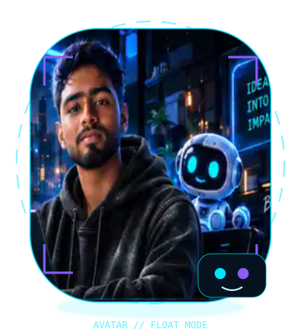

<br/><br/>

<a href="https://github.com/Suryakanta-Creator"></a>
<a href="https://www.linkedin.com/in/suryakanta-bala-b820923aa/"></a>
<a href="mailto:myworldsurya912@gmail.com"></a>

<br/><br/>


</div>


<div align="center">
</div>


## `// WHO_AM_I`

<table>
<tr>
<td width="58%" valign="top">

```ts
const suryakanta = {
  username: "Suryakanta-Creator",
  education: "B.Tech Student",
  focus: ["Full Stack", "AI", "Software Engineering"],
  building: "Krushi Seva",
  philosophy: "Learn. Build. Grow. Repeat."
};
```

I like building software that feels **useful**, not just impressive.

My current direction is full-stack development with AI-powered features, strong backend fundamentals, modern interfaces, and projects aimed at real-world problems.

</td>
<td width="42%" valign="top">

### `SYSTEM_STATUS`

`● ONLINE` — Building & learning  
`● ACTIVE` — Krushi Seva  
`● ACTIVE` — Full-stack development  
`● EXPLORING` — AI-powered products  
`● QUEUED` — Personal portfolio  

<br/>

> **BUILD THINGS THAT MATTER.**

</td>
</tr>
</table>


## `// TECH_STACK`

<div align="center">
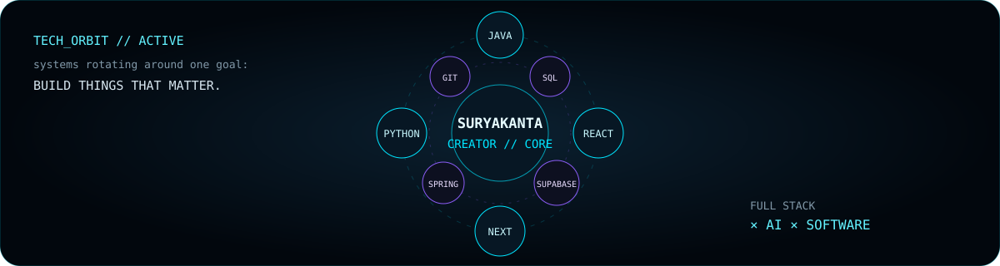
</div>

<br/>

### `ANIMATED_CORE`

<div align="center">

<table>
<tr>
<td align="center" width="110">
<br/><b>Java</b>
</td>
<td align="center" width="110">
<br/><b>JavaScript</b>
</td>
<td align="center" width="110">
<br/><b>Python</b>
</td>
<td align="center" width="110">
<br/><b>React</b>
</td>
<td align="center" width="110">
<br/><b>MySQL</b>
</td>
<td align="center" width="110">
<br/><b>GitHub</b>
</td>
</tr>
</table>

<sub>Animated SVG stack icons + a live orbit of technologies used across my projects.</sub>

</div>

### `LANGUAGES_&_FOUNDATIONS`
<div align="center">

<br/><br/>


</div>

### `FRONTEND_&_UI`
<div align="center">

<br/><br/>


</div>

### `3D_&_INTERACTION`
<div align="center">
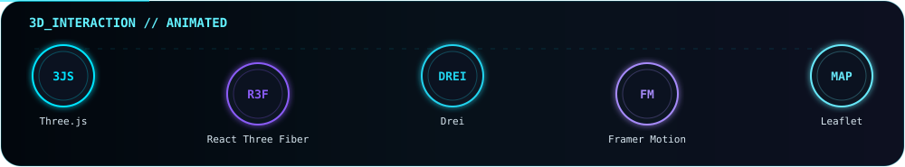
</div>

### `BACKEND_&_APIS`
<div align="center">
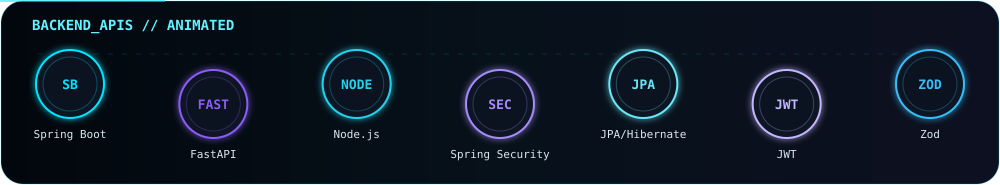
</div>

### `DATABASE_&_AUTH`
<div align="center">
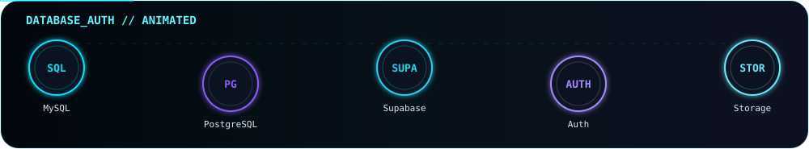
</div>

### `AI_&_COMPUTER_VISION`
<div align="center">
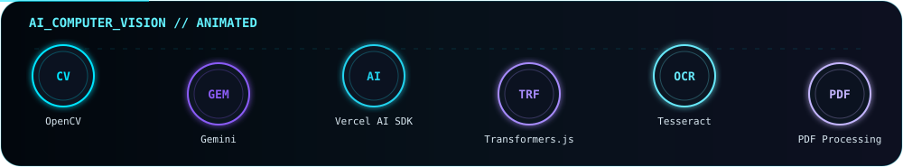
</div>

### `BUILD_DEPLOY_&_WORKFLOW`
<div align="center">
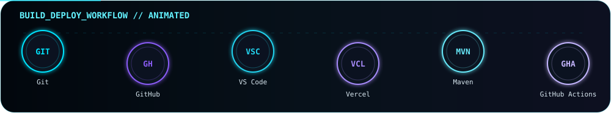
</div>


## `// PROJECT_RADAR`

<div align="center">
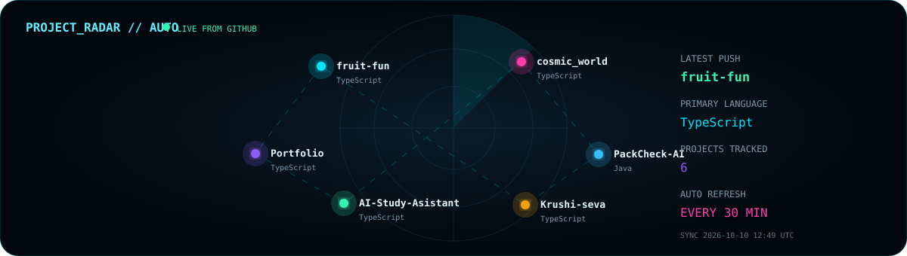
</div>


## `// FEATURED_BUILDS`

<table>
<tr>
<td width="33%" valign="top">

### 🌾 Krushi Seva

**AI-powered crop health platform**

Disease/pest detection, weather-assisted risk estimation, GIS outbreak intelligence, and farmer advisory workflows.

`Next.js` `TypeScript` `Supabase`  
`Tailwind` `Gemini` `Leaflet`

<p align="center"><a href="https://github.com/Suryakanta-Creator/Krushi-seva"></a></p>

</td>
<td width="33%" valign="top">

### 📦 PackCheck AI

**AI-assisted compliance system**

OCR-based label extraction, rule evaluation, evidence highlighting, and human review for packaged commodities.

`React` `Spring Boot` `Python`  
`FastAPI` `MySQL` `OpenCV`

<p align="center"><a href="https://github.com/Suryakanta-Creator/PackCheck-AI"></a></p>

</td>
<td width="33%" valign="top">

### 🌌 Cosmic World

**Interactive space experience**

A creative space-themed project focused on immersive visuals, exploration, and interactive web experiences.

`Interactive Web` `Creative UI`  
`Space Experience`

<p align="center"><a href="https://github.com/Suryakanta-Creator/cosmic_world"></a></p>

</td>
</tr>
</table>


## `// ARCADE_MODE`

<div align="center">

### 🐍 Contribution Snake

<picture>
  <source media="(prefers-color-scheme: dark)" srcset="./assets/github-snake-dark.svg" />
  <source media="(prefers-color-scheme: light)" srcset="./assets/github-snake.svg" />
  
</picture>

<sub>Generated automatically from my real contribution graph.</sub>

<br/><br/>

### 👾 Pac-Man Contribution Run

<picture>
  <source media="(prefers-color-scheme: dark)" srcset="https://raw.githubusercontent.com/Suryakanta-Creator/Suryakanta-Creator/output/pacman-contribution-graph-dark.svg" />
  <source media="(prefers-color-scheme: light)" srcset="https://raw.githubusercontent.com/Suryakanta-Creator/Suryakanta-Creator/output/pacman-contribution-graph.svg" />
  
</picture>

<sub>Pac-Man is regenerated automatically from GitHub activity.</sub>

</div>


## `// LIVE_TELEMETRY`

<div align="center">


<sub>Generated from the GitHub API and refreshed automatically every day.</sub>

</div>


## `// CURRENTLY_EXPLORING`

<div align="center">


</div>


## `// CONTRIBUTION_WORLD_3D`

<div align="center">

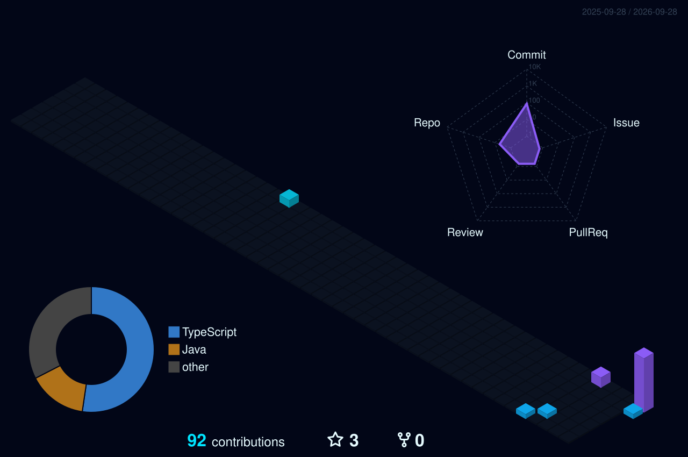

<sub>Automatically generated from my real GitHub contribution history.</sub>

</div>


## `// CURRENT_BUILD_MODE`

```text
╭─ SURYAKANTA-CREATOR
│
├─ 01  learn something difficult
├─ 02  build something useful
├─ 03  break it
├─ 04  understand why
├─ 05  rebuild it better
│
╰─ status: IN PROGRESS_
```

<div align="center">


</div>


## `// CONNECT_WITH_ME`

<div align="center">

<a href="https://github.com/Suryakanta-Creator"></a>
<a href="https://www.linkedin.com/in/suryakanta-bala-b820923aa/"></a>
<a href="mailto:myworldsurya912@gmail.com"></a>

<br/><br/>


<br/><br/>

### `SURYAKANTA // CREATOR`
**Build useful things. Keep learning. Keep shipping.**

</div>

<br/>

<div align="center">


<br/>


</div>

